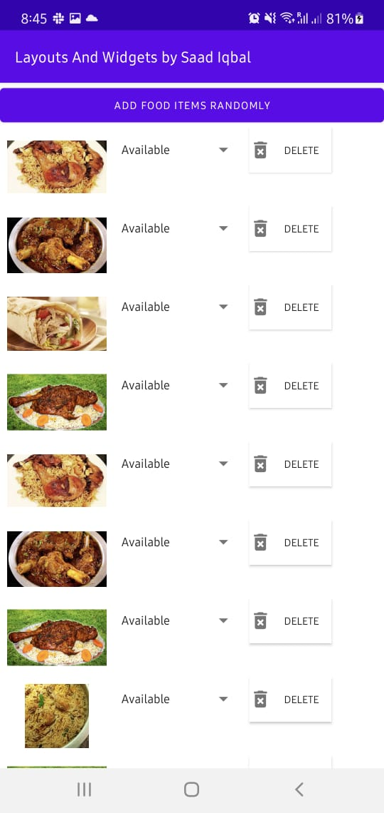

# Warmup_Week04_Day04 🔥
---
# Food App

## What you'll do

- 1. Create a new sndroid app
- 2. Name your app: DynamicInterfacesWithLayoutsAndWidgets
- 3. Create a button with the text "ADD FOOD ITEMS RANDOMLY"
- 4. Create a list of atleast 7 to 8 food images.
- 5. Upon Clicking of button, all the views should be generated programmatically on the runtime.

## Here's what the finished app looks like:

